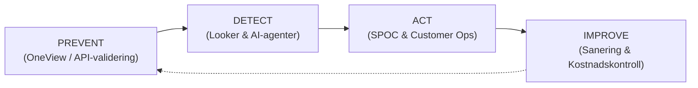
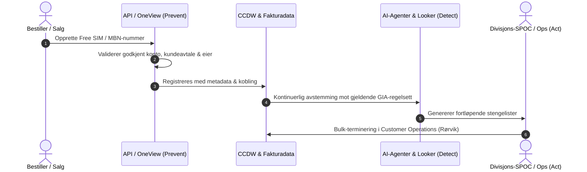
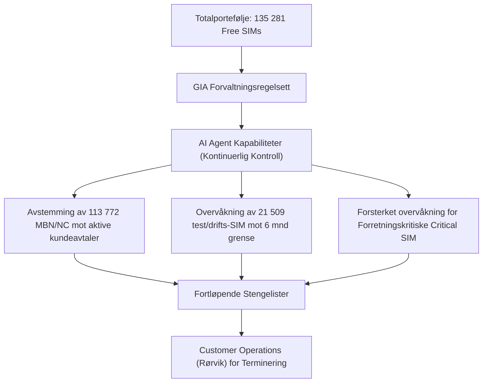

# Beslutningsnotat: Forvaltning og AI-agentstøtte for Mobile Free SIMs

**Dokumenttype:** Beslutningsnotat / Styringsunderlag  
**Saksbehandler:** Tor Marstein / Telenor Business  
**Dato:** 18. september 2026  
**Målgruppe:** Ledelsen i Telenor Business / GIA & ICFR Styringsgruppe  
**Status:** Til beslutning  

---

## 1. Hensikt og Sammendrag

Dette beslutningsnotatet etablerer et helhetlig, automatisert styrings- og forvaltningsregime for mobilabonnementer og SIM-kort betalt av Telenor Norge AS (Free SIMs), som direkte oppfølging av internrevisjonen (GIA Audit) og internkontrollkrav (ICFR NOR 72).

### Nøkkeltall for porteføljen:
* **Totalt volum:** 135 281 abonnementer fordelt på over 1 300 kontoer.
* **Logiske numre (84 % / 113 772 abn):** MBN og Nordic Connect (NC) logiske numre for sentralbord, svargrupper og køer.
* **Test-, drifts- og ustrukturerte SIM (16 % / 21 509 abn):** Testnummer, operative SIM og utstyrs-SIM som krever særskilt oppfølging og sanering.

### Anbefalt tiltak & Formål:
Det foreslås å godkjenne forvaltningsmodellen (*Prevent ➔ Detect ➔ Act ➔ Improve*), forankre 6 ufravikelige forvaltningskrav, etablere Google Cloud Looker som operativ arbeidsflate, samt innføre **AI-agentstøtte** med følgende hovedmandat:

1. **AI-styrte stengelister for alle Free SIM:** For alle Free SIM skal det etableres AI agent kapabiliteter som, basert på gjeldende regelsett gitt av GIA-forvaltningsregimet, utarbeider stengelister fortløpende som går til terminering.
2. **Revisjonssikkerhet & Inntektssikring:** Sikre Telenor mot inntektstap/svindel og oppnå 100 % revisjonssikker styring iht. GIA og ICFR NOR 72.

---

## 2. Bakgrunn og Problemstilling

Telenor Norge er registrert som betaler for ca. 135 000 abonnementer. Tidligere praksis har manglet tilstrekkelig automatisk systemstøtte for å sikre sporbarhet på formål, levetid og kostnadsbærer. Dette har medført:
1. **Foreldede / 'døde' MBN/NC-numre:** Logiske nummer som henger igjen i systemene etter opphørte kundeforhold eller avtalenedgraderinger.
2. **Økonomisk risiko:** Fare for at Telenor feilaktig dekker abonnementer som skulle vært fakturert sluttkunde eller avsluttet.
3. **Sikkerhets- og misbruksrisiko:** Uidentifiserte SIM-kort i omløp uten aktiv kontrolleier.
4. **Manuell ressursbruk:** Tunge, manuelle kontrollrutiner for divisjons-SPOC-er ved kvartalsvis og årlig rapportering.

---

## 3. Forvaltningsmodell: *Prevent ➔ Detect ➔ Act ➔ Improve*

Forvaltningen bygges rundt fire sammenhengende pilarer:

1. **Prevent (Hindre feil ved kilden):** Ordrekanaler (OneView, Eureka, OFM) tillater kun opprettelse av Free SIM på godkjente kontoer med obligatorisk kobling til aktiv MBN/NC-avtale eller kontrolleier.
2. **Detect (Løpende avviksfangst):** AI-agenter og Google Cloud Looker kjører kontinuerlig validering mot aktive kundeavtaler og trafikklogger for å identifisere inaktive eller ugyldige nummer.
3. **Act (Rask oppfølging):** AI-agentene genererer fortløpende stengelister som rutes til SPOC og Customer Operations for månedlig bulk-terminering.
4. **Improve (Måling & Styring):** Kontinuerlig overvåkning av porteføljestørrelse, kostnadsutvikling, dokumenterte revisjonsbevis og løsningstid for avvik (MTTR).

---

## 4. De 6 Forvaltningskravene

| Nr | Krav | Formål & Implementering |
| :--- | :--- | :--- |
| **1** | **Bevist kundebetaling for MBN & NC** | Maskinell kobling som beviser at logiske MBN/NC-nummer dekkes av en gyldig kundeavtale, med automatisk stenging ved opphør. |
| **2** | **Maks 6 måneders levetid for Test-1 SIM** | Automatisk tildeling av utløpsdato (`End Date`) ved opprettelse. Automatisk terminering ved utløp med mindre begrunnet forlengelse er godkjent. |
| **3** | **API / OneView regelhåndheving** | Endringsrobust regelsett implementert i ordrekanalene med fail-safe mekanismer. |
| **4** | **Google Cloud Looker (GCL) som operativ flate** | Felles dashbord for Customer Operations og SPOC-er med sanntids avvikslister og varsler. |
| **5** | **Kategoribasert forvaltning (Critical, Ops, Test)** | Tydelig eierskap og tilpassede SLA-er per kategori: *Critical & Operational SIM* (Geir Kolstad), *Test SIM* (primær + deputies: Tor Marstein, Kjetil Furuly, Jesper Lade). |
| **6** | **Forretningskritisk forvaltning** | Strengere prevent-detect-act kontroll for Critical SIM via GCP / AI Agent / SIM-forvaltning. |

---

## 5. Implementering av AI-agentstøtte

AI-agentene etableres som en helhetlig stengelistemotor for alle Free SIM:

### AI-agentenes kjernefunksjoner:
* **GIA-regelbasert porteføljekontroll:** AI-agentene kryss-sjekker daglig alle 135 281 abonnementer mot aktive kundeavtaler, trafikklogger og tidsfrister.
* **Automatisk bevisføring for revisjon:** Genererer dokumenterte bevis for GIA og ICFR NOR 72 på gyldigheten til aktive numre.
* **Fortløpende stengelister til terminering:** Identifiserer automatisk ureglementerte, foreldreløse eller inaktive SIM-kort og overfører ferdige stengelister direkte til Customer Operations (Rørvik).

---

## 6. Styringsstruktur, Forankring og IT-ressursbehov

Divisjonsansvarlige SPOC-er verifiseres årlig av CxO-nivået:

| Divisjon / Område | CxO Nivå | Oppnevnt Divisjons-SPOC | Ansvarsområde |
| :--- | :--- | :--- | :--- |
| **Business** | Torfinn Eriksen / Nikolay / Annelene | **Tor Marstein** | Eier MBN/NC (84 %) & B2B portefølje |
| **Technology** | Roger Nerli | **Geir Kolstad** | Eier Critical & Operational SIM |
| **Security Solutions & Mobile** | Ric Brown | **Rikke K. Nielsen** | Sikkerhets- og mobiltjenester |
| **Entertainment & Internet** | Magnus S. Aasjord | **Anna Hvattum** | Bredbånd og TV-tjenester |
| **Wholesale** | Ludwig Ulmer / Hugo Erichsen | **Kjetil Jacobsen** | Grossist- og operatør-SIM |
| **IT** | Torbjørn Larsen | **Hanne Sveipe Thowsen** | IT-utvikling, prosessforvaltning & kontrollsystemer |
| **People & Organization** | Kristin Ruud | **Pero Markanovic** | Ansatt- og HR-tildelinger |

> [!IMPORTANT]
> **Kritisk forutsetning for IT / Technology:**  
> For å sikre stabil gjennomføring og kontinuerlig drift forutsettes det at det prioriteres inn dedikerte IT-ressurser hos IT / Technology som sikrer korrekt forvaltning og kontroll av IT-prosesser og agenter for å forvalte kontrollmekanismene.

---

## 7. Forslag til Vedtak / Beslutningspunkter

Det innstilles på at ledelsen fatter følgende 6 vedtak og forutsetninger:

1. **Godkjenning av forvaltningsmodell:** Forvaltningsrammeverket (*Prevent-Detect-Act-Improve*) og de 6 definerte kravene godkjennes som gjeldende standard for Telenor Business.
2. **AI-agent mandat for stengelister og terminering:** For alle Free SIM etableres det AI agent kapabiliteter som, basert på gjeldende regelsett gitt av GIA forvaltningsregimet, utarbeider stengelister fortløpende som går til terminering.
3. **Forretningskritisk forvaltning (Critical SIM):** Forretningskritisk forvaltning, (critical SIM), klassifiseres som forretningskritiske abonnement, og dermed håndteres med et strengere kontroll- og forvaltningsregime enn øvrige kategorier gjennom GCP flater / AI Agent kapabiliteter / SIM - forvaltning.
4. **Håndheving av levetid for test-SIM:** Det innføres standard 6 måneders levetid og automatisk terminering for alle nye Test-1 abonnementer.
5. **Etablering av Looker & Operativ enhet:** Google Cloud Looker etableres som offisiell oppfølgingsflate, og Customer Operations (Rørvik) gis mandat til månedlige bulk-saneringer etter stengelister fra AI-agentene og SPOC-ene.
6. **IT-ressursforutsetning (IT / Technology):** Forutsettes at det prioriteres inn IT ressurser hos IT Technology som sikrer korrekt forvaltning og kontroll av IT prosesser og agenter for å forvalte kontrollmekanismene.
