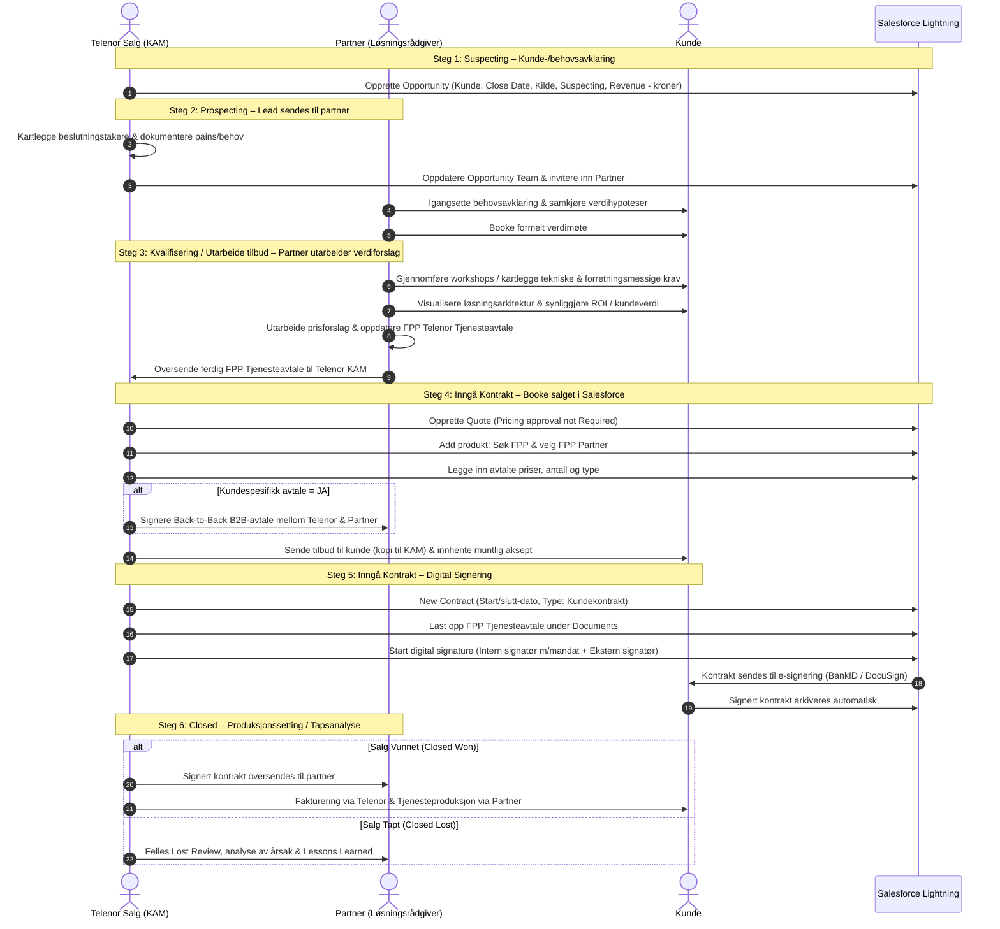

# Forenkling av Partnerprosess i Salesforce (inkl. B2B & FPP)

Dette dokumentet beskriver den standardiserte salgsprosessen og samspillet mellom **Telenor Salg** og **Partnere** (Fast Partner Pris - FPP / Business Partner Access - BPA) i Salesforce Lightning. Prosessen dekker metodikken for Verdibasert Salg (VBS), digital signeringsflyt (BankID / DocuSign), Back-to-back B2B-avtale ved kundespesifikke krav, og påkrevde juridiske standardklausuler.

---

## Innholdsfortegnelse
1. [Overordnet Prosessoversikt & 6-Trinns Samspill](#1-overordnet-prosessoversikt--6-trinns-samspill)
2. [Salesforce Salgssteg & Trinn-for-Trinn Klikkvei](#2-salesforce-salgssteg--trinn-for-trinn-klikkvei)
3. [Omfattende Salgsveiledning & Kritiske Spørsmål (Guidance)](#3-omfattende-salgsveiledning--kritiske-spørsmål-guidance)
4. [B2B Back-to-Back Avtale & Juridisk Kvalitetssikring](#4-b2b-back-to-back-avtale--juridisk-kvalitetssikring)
5. [VBS (Verdibasert Salg) Faser & KPI-er](#5-vbs-verdibasert-salg-faser--kpi-er)
6. [Oppdaterte Sjekklister for Roller](#6-oppdaterte-sjekklister-for-roller)
7. [Kundespesifikke Avtaler & Standardklausuler](#7-kundespesifikke-avtaler--standardklausuler)
8. [Referanser & Salesforce Eksempler](#8-referanser--salesforce-eksempler)

---

## 1. Overordnet Prosessoversikt & 6-Trinns Samspill

Salgsprosessen koordineres gjennom Salesforce Lightning og fordeler ansvaret mellom Telenor Kundeansvarlig (KAM/Selger) og Partner:



---

## 2. Salesforce Salgssteg & Trinn-for-Trinn Klikkvei

| Steg | Salesforce Salgssteg | Hovedansvar | Nøkkelhandlinger |
| :--- | :--- | :--- | :--- |
| **Steg 1** | `Suspecting` | Telenor / Partner | Opprette Opportunity & registrere Revenue-verdi |
| **Steg 2** | `Prospecting` | Telenor / Partner | Avklare beslutningstakere, oppdatere Opportunity Team & booke verdimøte |
| **Steg 3** | `Kvalifisering / Utarbeide tilbud` | Partner | Utarbeide løsningsarkitektur, ROI og FPP Tjenesteavtale |
| **Steg 4** | `Inngå Kontrakt` (Quote) | Telenor | Booke Quote i Salesforce m/FPP-produkt og B2B-avtaleavsjekk |
| **Steg 5** | `Inngå Kontrakt` (Signering) | Telenor | Opprette Contract, laste opp under Documents & e-signering |
| **Steg 6** | `Closed` | Telenor / Partner | Produksjonssetting (Won) eller Lost Review (Lost) |

---

### Detaljert Klikkvei per Steg:

#### Steg 1: Igangsette kunde-/behovsavklaring (`Suspecting`)
* **Ansvarlig**: Telenor / Partner
* **Klikkvei i Salesforce**:
  1. **Velg Kunde**: Søk opp og registrer kunden.
  2. **Velg Opportunity**: Legg inn beskrivende opportunity-navn.
  3. **Velg Close date**: Sett forventet lukkedato.
  4. **Velg salgssteg**: Sett til `Suspecting`.
  5. **Velg Opportunity kilde**: Registrer kilde (f.eks. Innkommende, Anbud, Kampanje).
  6. **Velg probability**: Angi estimert sannsynlighet.
  7. **Kundebehovsanalyse**: Igangsatt.
  8. **Revenue-krav**: *Må quote inn kundeverdier i Revenue – kroner*.

---

#### Steg 2: Lead sendes til partner (`Prospecting`)
* **Ansvarlig**: Telenor / Partner
* **Handlinger i Salesforce & Samhandling**:
  1. **Telenor**: Avklarer beslutningstakere hos kunden.
  2. **Telenor**: Dokumenterer pains og forretningsbehov i Salesforce.
  3. **Telenor**: Inviterer inn sertifisert partner til behovs- og løsningsavklaring.
  4. **Telenor**: Oppdaterer **Opportunity Team** i Salesforce med partnerressurser.
  5. **Partner**: Mottar lead og igangsetter aktiv dialog med kunden.
  6. **Partner/Telenor**: Samkjører verdihypoteser og booker formelt verdimøte.

---

#### Steg 3: Partner utarbeider verdiforslag (`Kvalifisering / Utarbeide tilbud`)
* **Ansvarlig**: Partner (Løsningsrådgiver)
* **Handlinger**:
  1. **Partner**: Kartlegger tekniske krav og suksesskriterier via workshops/intervjuer.
  2. **Partner**: Visualiserer foreslått løsning (arkitektur, komponenter, integrasjoner, ansvarsforhold).
  3. **Partner**: Utarbeider løsnings- og prisforslag som kunden bekrefter.
  4. **Partner**: Fyller ut og oppdaterer **FPP Telenor Tjenesteavtale** med priser og spesifikasjoner.
  5. **Partner**: Oversender ferdig oppdatert FPP Tjenesteavtale til Telenor KAM.

---

#### Steg 4: Booke salget i Salesforce (`Inngå Kontrakt / Quote`)
* **Ansvarlig**: Telenor Salg
* **Klikkvei i Salesforce**:
  1. **Velg Quote**: Opprett ny Quote og legg inn Quote-navn.
  2. **Velg**: Sett `Pricing approval not Required` (for standard FPP-satser).
  3. **Lagre Quoten** og åpne den.
  4. **Add produkt**: Søk etter `FPP`.
  5. **Velg produkt**: Velg ønsket **FPP Partner**.
  6. **Trykk Next**: Legg inn avtalte priser, antall, type mm.
  7. **Fullfør**: Salget er booket.
  8. **B2B-krav**: **Dersom kundespesifikk avtale = JA &rarr; Signer Back-to-Back B2B-avtale med partner.**
  9. **Sende tilbud**: Formell oversendelse til kunden med kopi til KAM & innhente muntlig aksept.

---

#### Steg 5: Oppdater kontrakt og få den signert (`Inngå Kontrakt / Signering`)
* **Ansvarlig**: Telenor Salg
* **Klikkvei i Salesforce**:
  1. **Velg New Contract**: Opprett ny kontrakt under kunden.
  2. **Datoer**: Sett start- og sluttdato for kontrakten.
  3. **Agreement Between**: Sett `Kunde og Telenor`.
  4. **Type**: Velg `Kundekontrakt`.
  5. **Gå inn på Contracts og kontrakten**.
  6. **Last opp dokument**: Last opp **FPP Telenor Tjenesteavtale** under fanen `Documents`.
  7. **Start digital signature**: Start e-signeringsflyt (BankID / DocuSign).
  8. **Velg internal signerer med mandat**: Telenors signaturberettigede.
  9. **Velg external signerer**: Kundens signaturberettigede kontaktperson.
  10. **Submit**: Kontrakten sendes automatisk til e-signering.
  11. **Kvalitetssikring**: Verifisere gyldig digital signatur fra begge parter.

---

#### Steg 6: Igangsett produksjonssetting / tapsanalyse (`Closed`)
* **Ansvarlig**: Telenor Salg & Partner
* **Handlinger**:
  * **Ved Vunnet (Closed Won - Produksjonssetting)**:
    1. Signert kontrakt oversendes partner for teknisk oppstart.
    2. Fakturering igangsettes via Telenor.
    3. Tjenesteproduksjon og teknisk oppsett igangsettes via partner.
  * **Ved Tapt (Closed Lost - Tapsanalyse)**:
    1. Opportunity settes til `Closed Lost`.
    2. Gjennomføre felles *Lost Review* mellom Partner og Telenor.
    3. Dokumentere årsak til tapt salgsmulighet og registrere *Lessons Learned*.

---

## 3. Omfattende Salgsveiledning & Kritiske Spørsmål (Guidance)

Veiledningsmatrisen gir selgere og løsningsrådgivere konkrete faglige sjekkpunkter for hver fase:

### Steg 1: Suspecting
* **a. Kartlegge volum og historikk**: Innhente data på eksisterende forbruk, lisenser og trafikk.
* **b. Identifisere relevante stakeholdere**: Kartlegge beslutningstakere (IT-sjef, innkjøpsleder, daglig leder) og sentrale påvirkere.
* **c. Starte arbeidet med verdiforslag gjennom hypoteser**: Formulere hypoteser om forretningsverdi, effektivisering og besparelser (VBS).
* **d. Gjennomføre første dialog med kunden og planlegge førstegangsmøte**: Gjennomføre introsamtale og koble på sertifisert partner.

---

### Steg 2: Prospecting
* **a. Etablere dialog med interessenter og beslutningstakere**: Sikre tilgang til personer som påvirker eller beslutter kjøpet.
* **b. Kartlegge kundens utfordringer (pains)**: Identifisere forretningsutfordringer, flaskehalser, behov og ønskede gevinster.
* **c. Invitere partner til behovsavklaring**: Engasjere sertifisert partner for å bidra i kartlegging og teknisk løsningsdialog.
* **d. Tilpasse kundens kjøpsprosess til Telenors salgsprosess**: Sikre felles forståelse av beslutningspunkter, tidslinje og neste steg.
* **e. Oppdatere Opportunity Team i Salesforce**: Registrere relevante ressurser og sikre riktig eierskap til salgsmuligheten.
* **f. Koble på sertifisert partner og løsningsrådgiver**: Tildele saken til fagressurser med riktig kompetanse og erfaring.
* **g. Samkjøre verdihypoteser**: Avstemme kundens utfordringer, forventede gevinster og forberede agenda for verdimøtet.
* **h. Booke formelt verdimøte**: Bekrefte møtetidspunkt med kundens nøkkelpersoner og relevante deltakere.

---

### Steg 3: Kvalifisering / Utarbeide tilbud
* **a. Sikre felles forståelse av kundebehov og muligheter**: Samarbeide med partner om salgsstrategi, kundetilnærming og verdiforslag.
* **b. Knytte løsning til kundens behov og forretningsmål**: Utvikle et kundetilpasset verdiforslag som adresserer kundens pains, behov og gevinster for beslutningstakere.
* **c. Visualisere foreslått løsning**: Beskrive løsningsarkitektur, tjenestekomponenter, integrasjoner og ansvarsforhold på et overordnet nivå (high-level design).
* **d. Kartlegge kundens behov og krav**: Gjennomføre workshops, intervjuer eller kundemøter for å identifisere forretningsmessige utfordringer, tekniske krav og suksesskriterier.
* **e. Synliggjøre kundeverdi**: Presentere løsningsforslag, ROI-beregninger, gevinster og relevante kundecaser tilpasset kundens situasjon.
* **f. Utarbeide konkurransedyktig tilbud**: Sammenstille felles løsningsforslag, prisstruktur, tjenestebeskrivelser og øvrig dokumentasjon.

---

### Steg 4: Inngå Kontrakt (Quote & Tilbud)
* **a. Sammenstille tilbudsunderlag**: Partner ferdigstiller løsningsbeskrivelse, avtaledokument og priser.
* **b. Oppdatere Quote i Salesforce**: Telenor legger inn produktlinjer og avtaleverdi.
* **c. Juridisk avsjekk**: Sikre Back-to-back B2B-avtale og direkte DPA mellom partner og kunde.
* **d. Sende tilbud til kunden**: Formell oversendelse med kopi til Telenor KAM.
* **e. Muntlig aksept fra beslutningstaker**: Verifisere aksept før kontraktsutstedelse.
* **f. Signer B2B-avtale med partner**: Påkrevd forutsatt at det foreligger kundespesifikke krav/avvik.

---

### Steg 5: Inngå Kontrakt (Signering)
* **a. Sluttforhandlinger**: Avklare eventuelle detaljer, leveringsfrister og SLA.
* **b. Elektronisk signering**: Sende avtaledokument til e-signering (BankID / DocuSign).
* **c. Kvalitetssikre signert avtale**: Verifisere gyldig signatur fra begge parter.

---

### Steg 6: Closed (Produksjon / Tapsanalyse)
* **a. Igangsette tjenesteproduksjon via partner og fakturering via Telenor**.
* **b. Lost review Partner og Telenor**: Felles gjennomgang og analyse ved tapt mulighet for kontinuerlig forbedring (*Lessons Learned*).

---

## 4. B2B Back-to-Back Avtale & Juridisk Kvalitetssikring

Når en kundeavtale inneholder **kundespesifikke krav, særskilte SLA-er, tilpasninger eller avvik fra standardvilkår**, utløses et formelt krav:

> [!IMPORTANT]
> **Trigger for B2B-avtale:**
> `Kundespesifikk avtale = JA` &rarr; Det **MÅ** etableres og signeres en **Back-to-Back B2B-avtale mellom Telenor og Partner** for å speile kundekravene juridisk og operativt.

### 4-Trinns Juridisk Sikring:
1. **Back-to-Back Avtale**: Speiler samtlige kundekrav overfor partneren slik at Telenor ikke sitter med udekket risiko.
2. **Direkte Databehandleravtale (DPA)**: Inngås direkte mellom partner og kunde for å sikre at Telenor ikke har behandleransvar i systemer Telenor ikke drifter eller har innsyn i.
3. **Prisreguleringsklausul (KPI)**: Sikrer årlig indeksregulering av underleverandørs priser.
4. **Varekostnadsklausul**: Sikrer adgang til å videreføre dokumenterte økte tredjepartskostnader.

---

## 5. VBS (Verdibasert Salg) Faser & KPI-er

| VBS Faser | Formål | Leveranse |
| :--- | :--- | :--- |
| **1. PROSPECTING** | Identifisere & prioritere | Kartlegge marked, historikk og kvalifisere leads. |
| **2. INTROSAMTALE** | Åpne døren med relevans | Presentere hypoteser og vekke interesse. |
| **3. SALGSMØTE** | Bygg tillit & forstå kunden | Dybdekartlegging av kundens reelle behov. |
| **4. VERDIBUDSKAP** | Koble løsning til mål | Skreddersy forretningscase, ROI og arkitektur. |
| **5. TILBUD** | Konkretisering av verdier | Utarbeide FPP-tjenesteavtale, priser og B2B-avsjekk. |
| **6. CLOSING** | Sikre salg & realisere verdi | E-signering (BankID), produksjonssetting og fakturering. |

### 10 Nøkkel-KPI-er:
1. **Antall VBS introsamtaler**
2. **Hit rate (samtale til møte)**
3. **Antall bookede VBS møter**
4. **Antall gjennomførte VBS salgsmøter**
5. **Antall kvalitetssikrede verdislides**
6. **Antall tilbud sendt**
7. **Close rate fra pipeline**
8. **Antall kontrakter signert**
9. **ARPU / Salget**
10. **Antall SIM**

---

## 6. Oppdaterte Sjekklister for Roller

### Sjekkliste for Telenor Selger / KAM
- [ ] **Steg 1**: Opprettet Opportunity med kilde, close date, salgssteg *Suspecting* og lagt inn *Revenue - kroner*.
- [ ] **Steg 1**: Kartlagt volum, historikk og identifisert relevante stakeholdere (IT, innkjøp, ledelse).
- [ ] **Steg 2**: Avklart beslutningstakere og dokumentert pains i Salesforce.
- [ ] **Steg 2**: Oppdatert Opportunity Team i Salesforce og invitert inn sertifisert FPP Partner.
- [ ] **Steg 4**: Opprettet Quote (`Pricing approval not Required`) og lagt inn produkt *FPP*, partner og avtalte priser.
- [ ] **Steg 4**: Verifisert om avtalen er kundespesifikk – hvis ja: signert **Back-to-Back B2B-avtale** med partner.
- [ ] **Steg 4**: Innhentet muntlig aksept fra beslutningstaker.
- [ ] **Steg 5**: Opprettet *New Contract* (`Agreement Between Kunde og Telenor`, Type: `Kundekontrakt`).
- [ ] **Steg 5**: Lastet opp ferdig utfylt **FPP Telenor Tjenesteavtale** under fanen *Documents*.
- [ ] **Steg 5**: Startet digital signering med intern mandatbærer og ekstern signatør (BankID/DocuSign).
- [ ] **Steg 6**: Oversendt signert kontrakt til partner og igangsatt fakturering (el. gjennomført *Lost Review*).

### Sjekkliste for Partner
- [ ] **Steg 2**: Mottatt lead og igangsatt aktiv behovsavklaring med kunden.
- [ ] **Steg 2**: Samkjørt verdihypoteser og booket formelt verdimøte.
- [ ] **Steg 3**: Gjennomført workshops/intervjuer og kartlagt tekniske krav og suksesskriterier.
- [ ] **Steg 3**: Visualisert foreslått løsning (arkitektur, integrasjoner, ansvarsforhold) og presentert ROI.
- [ ] **Steg 3**: Fått kundens bekreftelse på løsningsdesign og prisforslag.
- [ ] **Steg 3**: Fylt ut **FPP Telenor Tjenesteavtale** med korrekte priser og spesifikasjoner.
- [ ] **Steg 3**: Oversendt komplett FPP Tjenesteavtale til Telenor KAM.
- [ ] **Steg 4**: Etablert og signert Back-to-Back B2B-avtale mot Telenor ved kundespesifikke krav.
- [ ] **Steg 4**: Etablert direkte Databehandleravtale (DPA) mellom Partner og Kunde.
- [ ] **Steg 6**: Mottatt signert avtale fra Telenor og igangsatt teknisk produksjon og leveranse.

---

## 7. Kundespesifikke Avtaler & Standardklausuler

### Klausul 1: Årlig Prisjustering (KPI)
```text
Årlig prisjustering (KPI):
Underleverandørens priser kan justeres årlig ved årsskiftet i tråd med økningen i Statistisk sentralbyrås konsumprisindeks (hovedindeksen). Første justering baseres på indeksen for måneden avtalen ble signert.
```

### Klausul 2: Prisendring ved Økte Varekostnader
```text
Prisendring ved økte varekostnader:
Prisene kan også justeres dersom underleverandørens varekostnader fra tredjepart øker. I slike tilfeller skal leverandøren:
1. Varsle kunden om prisendringen.
2. Dokumentere grunnlaget for endringen.
Prisendringen trer i kraft fra det tidspunkt kunden mottar varselet.
```

### Klausul 3: Databehandleravtale (DPA)
```text
Databehandleravtale (DPA):
Det skal inngås en direkte databehandleravtale (DPA) mellom partner og kunde. Dette sikrer at Telenor ikke påtar seg ansvar for behandling av person- og kundedata i tjenester der Telenor ikke har innsyn i dataene.
```

### Klausul 4: Back-to-Back B2B-avtale (Speile Kundekrav)
```text
Back-to-back-avtale:
Det skal etableres en back-to-back-avtale mellom Telenor og partneren for den aktuelle tjenesten. Dette sikrer at alle kundespesifikke krav videreføres og etterleves av partneren.
```

---

## 8. Referanser & Salesforce Eksempler

Reelle referanse-eksempler i Salesforce Lightning:
* **Eksempel 1**: `https://telenor.lightning.force.com/lightning/r/Opportunity/006So00000mRqgRIAS/view`
* **Eksempel 2**: `https://telenor.lightning.force.com/lightning/r/Opportunity/006So00000mSOQLIA4/view`
