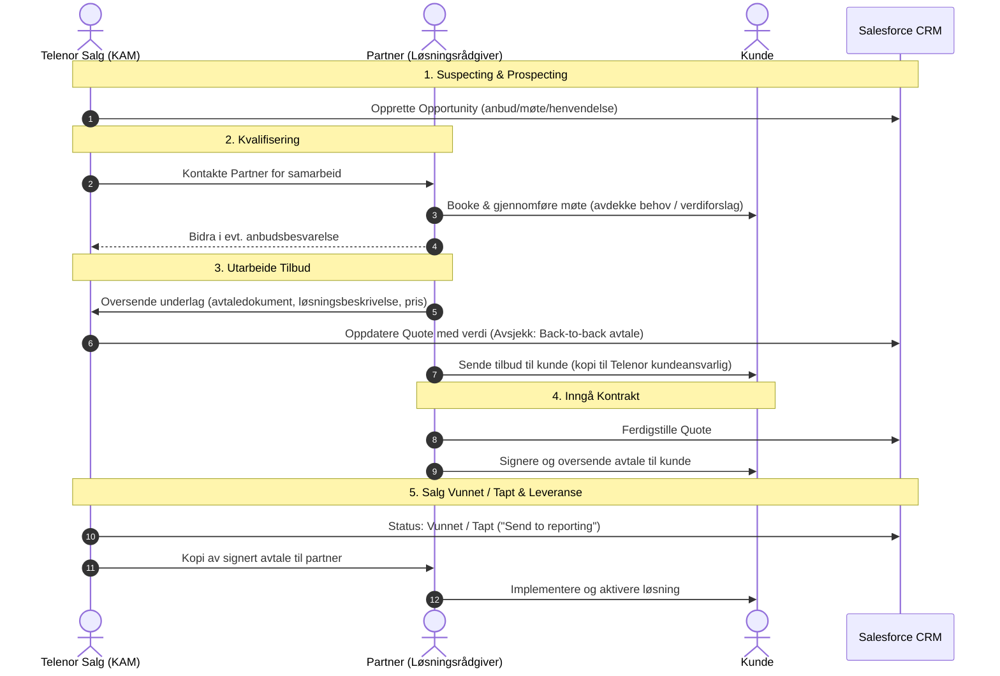

# Forenkling av Partnerprosess i Salesforce

Dette dokumentet beskriver den standardiserte salgsprosessen og samspillet mellom **Telenor Salg** og **Partnere** (Business Partner Access - BPA) i Salesforce, samt metodikken for Verdibasert Salg (VBS) og påkrevde juridiske standardklausuler for kundespesifikke avtaler.

---

## Innholdsfortegnelse
1. [Overordnet Prosessoversikt & Samspill](#1-overordnet-prosessoversikt--samspill)
2. [VBS (Verdibasert Salg) Faser & KPI-er](#2-vbs-verdibasert-salg-faser--kpi-er)
3. [Detaljert Prosessflyt Trinn-for-Trinn](#3-detaljert-prosessflyt-trinn-for-trinn)
4. [Sjekklister for Roller](#4-sjekklister-for-roller)
5. [Kundespesifikke Avtaler & Standardklausuler](#5-kundespesifikke-avtaler--standardklausuler)

---

## 1. Overordnet Prosessoversikt & Samspill

Salgsprosessen koordineres gjennom Salesforce og sikrer tydelig ansvarsdeling mellom Telenor Kundeansvarlig (KAM/Selger) og Partner:



---

## 2. VBS (Verdibasert Salg) Faser & KPI-er

Verdibasert salg sikrer at vi flytter fokus fra rene produktfunksjoner til reell forretningsverdi for kunden:

| VBS Salgsfase | Formål | Beskrivelse |
| :--- | :--- | :--- |
| **1. PROSPECTING** | Identifisere og prioritere | Kartlegge potensielle kunder og identifisere forretningsmuligheter. |
| **2. INTROSAMTALE** | Åpne døren med relevans | Første dialog med kunden basert på relevant innsikt og hypoteser. |
| **3. SALGSMØTE** | Bygg tillit & forstå kunden | Gjennomføre dybdeintervju og avdekke kundens reelle smertepunkter. |
| **4. VERDIBUDSKAP** | Koble løsning til mål | Skreddersy løsningsforslag som svarer direkte på kundens verdimål. |
| **5. TILBUD** | Konkretisering av verdier | Utforme helhetlig tilbud med avtaledokument, pris og forretningscase. |
| **6. CLOSING** | Sikre salg & realisere verdi | Forhandle, signere kontrakt og igangsette implementering. |

### Nøkkel-KPI-er i prosessen
1. **Antall VBS introsamtaler**: Måling av proaktivitet i åpningsfasen.
2. **Hit rate**: Andel samtaler som leder til kvalifiserte salgsmøter.
3. **Antall bookede VBS-møter**: Volum av planlagte kundedialoger.
4. **Antall gjennomførte VBS-salgsmøter**: Reell møteaktivitet.
5. **Antall kvalitetssikrede verdislides**: Grad av skreddersydd verdikommunikasjon.
6. **Antall tilbud sendt**: Volum i tilbudsfasen.
7. **Close rate fra pipeline**: Konverteringsrate fra tilbud til vunnet avtale.
8. **Antall kontrakter**: Totalt antall signerte avtaler.
9. **ARPU / Salget**: Gjennomsnittlig inntekt per bruker/kunde.
10. **Antall SIM**: Volum av abonnementer og oppkoblede enheter.

---

## 3. Detaljert Prosessflyt Trinn-for-Trinn

### Trinn 1: Suspecting / Prospecting
* **Ansvarlig**: Telenor Salg
* **Handling**: Oppretter *Opportunity* i Salesforce basert på anbud, kundemøte eller innkommende henvendelse.
* **Salesforce-fase**: Suspecting / Prospecting.
* **Krav**: Registrere kundenavn, antatt verdi, forretningsområde og kontaktperson.

### Trinn 2: Kvalifisering
* **Ansvarlig**: Telenor Salg & Partner
* **Handling**: 
  - Telenor kontakter aktuell Partner for å koble på rett kompetanse.
  - Partner booker møte med kunden, presenterer verdiforslag og avdekker kundens behov.
  - Partner bidrar aktivt i eventuell anbudsbesvarelse.
* **Salesforce-fase**: Kvalifisering (Booke møte & gjennomføre møte).

### Trinn 3: Utarbeide Tilbud
* **Ansvarlig**: Partner & Telenor Salg
* **Handling**:
  - **Partner**: Sammenstiller avtaledokument, løsningsbeskrivelse og prisoppsett. Sendes til Telenor kundeansvarlig.
  - **Telenor Salg**: Oppdaterer *Quote* i Salesforce med riktige verdier basert på underlaget fra Partner.
  - **Avsjekk**: Sikre at det foreligger en **Back-to-back-avtale** dersom kunden ikke skal benytte Telenors standard tjenesteavtale.
  - **Partner**: Sender formelt tilbud til kunde med kopi til Telenor kundeansvarlig.
* **Salesforce-fase**: Utarbeide tilbud.

### Trinn 4: Inngå Kontrakt
* **Ansvarlig**: Partner & Telenor Salg
* **Handling**:
  - Partner ferdigstiller *Quote* i Salesforce.
  - Avtalen signeres elektronisk (f.eks. via BankID / DocuSign) og oversendes kunden.
* **Salesforce-fase**: Inngå kontrakt.

### Trinn 5: Salg Vunnet / Tapt & Leveranse
* **Ansvarlig**: Telenor Salg & Partner
* **Handling**:
  - Telenor setter status til **Salg Vunnet** eller **Salg Tapt** og trigger «*Send to reporting*».
  - Kopi av signert avtale oversendes Partner for arkivering og provisjonsgrunnlag.
  - Partner starter implementering og aktivering av løsningen hos kunden.
* **Salesforce-fase**: Closed Won / Closed Lost & Leveranse.

---

## 4. Sjekklister for Roller

### Sjekkliste for Telenor Selger / KAM
- [ ] Opprettet Opportunity i Salesforce med nøyaktig kunde- og kontaktdata.
- [ ] Kontaktet og koblet på sertifisert Partner for løsningsområdet.
- [ ] Deltatt i/koordinert tilbudsunderlag med Partner.
- [ ] Verifisert avtaleform: Er det behov for Back-to-back-avtale?
- [ ] Oppdatert Quote i Salesforce med riktige linjeelementer og verdi.
- [ ] Mottatt bekreftelse på at tilbud er oversendt kunden.
- [ ] Satt Opportunity til «Closed Won» / «Send to reporting» ved signering.
- [ ] Distribuert kopi av signert avtale til Partner.

### Sjekkliste for Partner
- [ ] Gjennomført kvalifiseringsmøte og avdekket kundens behov og smertepunkter.
- [ ] Utarbeidet skreddersydde verdislides og forretningscase (VBS).
- [ ] Sammenstilt avtaledokument, teknisk løsningsbeskrivelse og prisoppsett.
- [ ] Sendt komplett underlag til Telenor kundeansvarlig for Quote-oppdatering.
- [ ] Inkludert standardklausuler for årlig KPI-justering og varekostnader.
- [ ] Sikret separat Databehandleravtale (DPA) direkte mellom Partner og Kunde.
- [ ] Etablert Back-to-back-avtale med Telenor dersom kundespesifikke krav krever det.
- [ ] Sendt tilbud til kunden med kopi til Telenor KAM.
- [ ] Ferdigstilt Quote og sikret gyldig signering.
- [ ] Etablert prosjektplan for implementering og aktivering.

---

## 5. Kundespesifikke Avtaler & Standardklausuler

Ved inngåelse og reforhandling av kundespesifikke avtaler skal følgende standardiserte tekster benyttes:

### Klausul 1: Årlig Prisjustering (KPI)
> **Formål**: Sikre at leverandørens priser justeres i tråd med den generelle prisveksten i samfunnet.
> 
```text
Årlig prisjustering (KPI):
Underleverandørens priser kan justeres årlig ved årsskiftet i tråd med økningen i Statistisk sentralbyrås konsumprisindeks (hovedindeksen). Første justering baseres på indeksen for måneden avtalen ble signert.
```

### Klausul 2: Prisendring ved Økte Varekostnader
> **Formål**: Beskytte marginer mot uforutsette prisøkninger fra tredjepartsleverandører (maskinvare, lisenser etc.).
> 
```text
Prisendring ved økte varekostnader:
Prisene kan også justeres dersom underleverandørens varekostnader fra tredjepart øker. I slike tilfeller skal leverandøren:
1. Varsle kunden om prisendringen.
2. Dokumentere grunnlaget for endringen.
Prisendringen trer i kraft fra det tidspunkt kunden mottar varselet.
```

### Klausul 3: Databehandleravtale (DPA)
> **Formål**: Sikre at Telenor ikke påtar seg ansvar for behandling av person- og kundedata i partnertjenester der Telenor ikke har innsyn i dataene.
> 
```text
Databehandleravtale (DPA):
Det skal inngås en direkte databehandleravtale (DPA) mellom partner og kunde. Dette sikrer at Telenor ikke påtar seg ansvar for behandling av person- og kundedata i tjenester der Telenor ikke har innsyn i dataene.
```

### Klausul 4: Back-to-back-avtale (Speile Kundekrav)
> **Formål**: Sikre at alle spesifikke krav stilt av kunden overfor Telenor automatisk videreføres og etterleves av partneren.
> 
```text
Back-to-back-avtale:
Det skal etableres en back-to-back-avtale mellom Telenor og partneren for den aktuelle tjenesten. Dette sikrer at alle kundespesifikke krav videreføres og etterleves av partneren.
```
