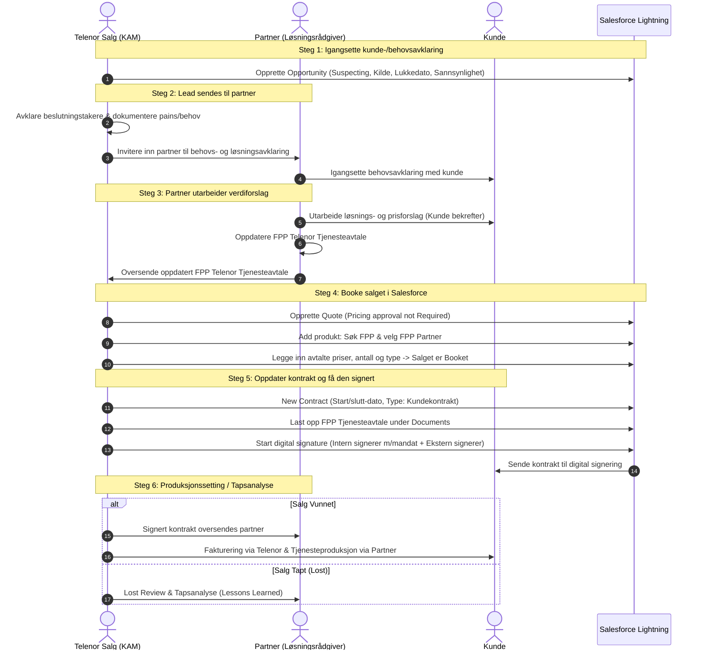

# Forenkling av Partnerprosess i Salesforce

Dette dokumentet beskriver den standardiserte salgsprosessen og samspillet mellom **Telenor Salg** og **Partnere** (Business Partner Access - BPA / Fast Partner Pris - FPP) i Salesforce Lightning, samt metodikken for Verdibasert Salg (VBS), digital signeringsflyt og påkrevde juridiske standardklausuler for kundespesifikke avtaler.

---

## Innholdsfortegnelse
1. [Overordnet Prosessoversikt & 6-Trinns Samspill](#1-overordnet-prosessoversikt--6-trinns-samspill)
2. [Trinn-for-Trinn Salesforce Klikkvei & Samhandlingsflyt](#2-trinn-for-trinn-salesforce-klikkvei--samhandlingsflyt)
3. [Salgsveiledning & Kritiske Spørsmål (Guidance)](#3-salgsveiledning--kritiske-spørsmål-guidance)
4. [VBS (Verdibasert Salg) Faser & KPI-er](#4-vbs-verdibasert-salg-faser--kpi-er)
5. [Oppdaterte Sjekklister for Roller](#5-oppdaterte-sjekklister-for-roller)
6. [Kundespesifikke Avtaler & Standardklausuler](#6-kundespesifikke-avtaler--standardklausuler)
7. [Referanser & Salesforce Eksempler](#7-referanser--salesforce-eksempler)

---

## 1. Overordnet Prosessoversikt & 6-Trinns Samspill

Salgsprosessen er strukturert i 6 sammenhengende faser med klar ansvarsfordeling mellom Telenor Kundeansvarlig (KAM/Selger) og Partner:



---

## 2. Trinn-for-Trinn Salesforce Klikkvei & Samhandlingsflyt

### Steg 1: Igangsette kunde-/behovsavklaring
* **Hovedansvar**: Telenor Salg
* **Salesforce Salgssteg**: `Suspecting`
* **Klikkvei i Salesforce**:
  1. **Velg Kunde**: Søk opp og registrer kunden.
  2. **Velg Opportunity**: Legg inn beskrivende Opportunity-navn.
  3. **Velg Close Date**: Sett forventet lukkedato.
  4. **Velg salgssteg**: Velg `Suspecting`.
  5. **Velg Opportunity kilde**: Registrer kilde (f.eks. Anbud, Innkommende, Kampanje).
  6. **Velg probability**: Sett estimert sannsynlighet.
  7. **Status**: Kunde-/behovsanalyse er igangsatt.

---

### Steg 2: Lead sendes til partner
* **Hovedansvar**: Telenor Salg & Partner
* **Salesforce Salgssteg**: `Kvalifisering`
* **Handlinger**:
  1. **Telenor**: Avklarer beslutningstakere hos kunden.
  2. **Telenor**: Dokumenterer kundens *pains* og behov i Salesforce.
  3. **Telenor**: Oppdaterer Opportunity Team og inviterer inn partner til behovs- og løsningsavklaring.
  4. **Partner**: Mottar lead og igangsetter grundig behovsavklaring sammen med kunden.

---

### Steg 3: Partner utarbeider verdiforslag
* **Hovedansvar**: Partner (Løsningsrådgiver)
* **Salesforce Salgssteg**: `Løsningsdesign / Verdiforslag`
* **Handlinger**:
  1. **Partner**: Utarbeider løsningsforslag og forankrer dette hos kunden.
  2. **Partner**: Utarbeider prisforslag som kunden bekrefter.
  3. **Partner**: Fyller ut og oppdaterer **FPP Telenor Tjenesteavtale** med endelig pris- og løsningsforslag.
  4. **Partner**: Oversender oppdatert FPP Telenor Tjenesteavtale til Telenor kundeansvarlig (KAM).

---

### Steg 4: Booke salget i Salesforce
* **Hovedansvar**: Telenor Salg
* **Salesforce Salgssteg**: `Utarbeide tilbud / Quote`
* **Klikkvei i Salesforce**:
  1. **Velg Quote**: Opprett ny Quote og legg inn Quote-navn.
  2. **Velg**: Sett `Pricing approval not Required` (ved standard FPP-satser).
  3. **Lagre Quoten**.
  4. **Gå inn på Quoten**.
  5. **Add produkt**: Søk etter `FPP`.
  6. **Velg produkt**: Velg ønsket **FPP partner**.
  7. **Trykk Next**.
  8. **Legg inn avtalte priser, antall, type mm.**.
  9. **Fullfør**: Salget er nå booket i Salesforce.

---

### Steg 5: Oppdater kontrakt og få den signert
* **Hovedansvar**: Telenor Salg
* **Salesforce Salgssteg**: `Inngå kontrakt / Signering`
* **Klikkvei i Salesforce**:
  1. **Velg New Contract**: Opprett ny kontrakt under kunden.
  2. **Velg kontrakt startdato**: Sett startdato.
  3. **Velg kontrakt sluttdato**: Sett utløpsdato.
  4. **Agreement Between**: Sett `Kunde og Telenor`.
  5. **Type**: Velg `Kundekontrakt`.
  6. **Gå inn på Contracts og kontrakten**.
  7. **Last opp dokument**: Last opp **FPP Telenor Tjenesteavtale** under fanen `Documents`.
  8. **Start digital signature**: Start digital signeringsprosess.
  9. **Velg internal signerer med mandat**: Telenors signaturberettigede.
  10. **Velg external signerer**: Kundens signaturberettigede kontaktperson.
  11. **Submit**: Kontrakten sendes automatisk til digital signering.
  12. **Signert avtale arkiveres** i Salesforce når signering er fullført.

---

### Steg 6: Igangsett produksjonssetting / tapsanalyse
* **Hovedansvar**: Telenor Salg & Partner
* **Salesforce Salgssteg**: `Closed Won` / `Closed Lost`
* **Handlinger**:
  * **Ved Vunnet Salg (Produksjonssetting)**:
    1. Signert kontrakt oversendes til partner for oppstart.
    2. Fakturering igangsettes via Telenor.
    3. Tjenesteproduksjon og teknisk oppsett igangsettes via partner.
  * **Ved Tapt Salg (Tapsanalyse)**:
    1. Opportunity settes til `Closed Lost`.
    2. Gjennomføre felles tapsanalyse (*Lost Review*) mellom Partner og Telenor.
    3. Dokumentere årsak til tapt mulighet og registrere *Lessons Learned*.

---

## 3. Salgsveiledning & Kritiske Spørsmål (Guidance)

For å sikre høy kvalitet i alle faser stilles følgende kontrollspørsmål for hvert trinn:

| Steg | Veiledningsspørsmål & Sjekkpunkter (Guidance) |
| :--- | :--- |
| **Steg 1: Behovsavklaring** | • Kartlegge as-is på eksisterende kunder?<br>• Identifisere relevante stakeholdere?<br>• Start arbeidet med verdiforslag gjennom hypoteser?<br>• Gjennomfør første dialog med kunden og planlegg for førstegangsmøte. |
| **Steg 2: Lead til Partner** | • Oppnå dialog med stakeholdere og beslutningstakere?<br>• Kartlegge pains/smertepunkter grundig.<br>• Inviter partner til å igangsette behovsavklaring.<br>• Aligne kundens kjøpsprosess med Telenor salgsprosess.<br>• Oppdater Opportunity Team i Salesforce. |
| **Steg 3: Verdiforslag** | • Sparr med partner om løsningsarkitektur.<br>• Utarbeide verdiforslag tilpasset kunden, bekrefte pains/behov og relevans for beslutningstakere.<br>• Utarbeide løsningsskisser (*high-level design*) der det er relevant. |
| **Steg 4: Booke Salget** | • Sikre enighet med kunde om løsningsdesign og pris.<br>• Utarbeide og sende ut tilbud til kunde via standard Tilbudsmal.<br>• Sign-off skal være komplett før tilbud sendes kunde.<br>• Presentere tilbud til beslutningstaker og relevante stakeholdere.<br>• Innhente muntlig aksept fra beslutningstaker. |
| **Steg 5: Signering** | • Booke salgspris korrekt i Salesforce.<br>• Signere kontrakt digitalt via godkjent signeringsflyt.<br>• Verifisere opplastet FPP Tjenesteavtale under Documents. |
| **Steg 6: Leveranse / Tapsanalyse** | • Igangsette tjenesteproduksjon via partner og fakturering via Telenor.<br>• Gjennomføre felles *Lost Review* ved tapt sak for kontinuerlig forbedring. |

---

## 4. VBS (Verdibasert Salg) Faser & KPI-er

| VBS Faser | Formål | Leveranse |
| :--- | :--- | :--- |
| **1. PROSPECTING** | Identifisere & prioritere | Kartlegge marked og kvalifisere leads. |
| **2. INTROSAMTALE** | Åpne døren med relevans | Presentere hypoteser og vekke interesse. |
| **3. SALGSMØTE** | Bygg tillit & forstå kunden | Dybdekartlegging av kundens reelle behov. |
| **4. VERDIBUDSKAP** | Koble løsning til mål | Skreddersy forretningscase og ROI-modell. |
| **5. TILBUD** | Konkretisering av verdier | Utarbeide FPP-tjenesteavtale, prisoppsett og avtaledokument. |
| **6. CLOSING** | Sikre salg & realisere verdi | Digital signering, produksjonssetting og gevinstrealisering. |

### Nøkkel-KPI-er:
1. **Antall VBS introsamtaler**
2. **Hit rate (samtale til møte)**
3. **Antall bookede VBS møter**
4. **Antall gjennomførte VBS salgsmøter**
5. **Antall kvalitetssikrede verdislides**
6. **Antall tilbud sendt**
7. **Close rate fra pipeline**
8. **Antall kontrakter signert**
9. **ARPU / Salget**
10. **Antall SIM**

---

## 5. Oppdaterte Sjekklister for Roller

### Sjekkliste for Telenor Selger / KAM
- [ ] Opprettet Opportunity med kilde, close date og salgssteg *Suspecting*.
- [ ] Avklart beslutningstakere og dokumentert pains i Salesforce.
- [ ] Oppdatert Opportunity Team og invitert inn sertifisert FPP Partner.
- [ ] Opprettet Quote (`Pricing approval not Required`) og lagt inn FPP-produkt og partner.
- [ ] Verifisert avtaletype og eventuelt behov for Back-to-back-avtale.
- [ ] Opprettet *New Contract* (`Agreement Between Kunde og Telenor`, Type: `Kundekontrakt`).
- [ ] Lastet opp ferdig utfylt **FPP Telenor Tjenesteavtale** under *Documents*.
- [ ] Sendt til digital signering med intern og ekstern signatør.
- [ ] Distribuert signert avtale til partner og igangsatt fakturering.
- [ ] Ved tapt avtale: Gjennomført felles *Lost Review* og dokumentert årsak.

### Sjekkliste for Partner
- [ ] Mottatt lead og igangsatt behovsavklaring med kunden.
- [ ] Gjennomført kvalifiseringsmøte og avdekket tekniske/operative behov.
- [ ] Utarbeidet skreddersydde verdislides og high-level løsningsskisse.
- [ ] Fått kundens bekreftelse på løsningsdesign og prisforslag.
- [ ] Fylt ut **FPP Telenor Tjenesteavtale** med korrekte priser og spesifikasjoner.
- [ ] Oversendt komplett FPP Tjenesteavtale til Telenor KAM.
- [ ] Sikret direkte Databehandleravtale (DPA) mellom Partner og Kunde.
- [ ] Etablert Back-to-back-avtale mot Telenor for speiling av kundekrav.
- [ ] Mottatt signert avtale fra Telenor og igangsatt tjenesteproduksjon.

---

## 6. Kundespesifikke Avtaler & Standardklausuler

### Klausul 1: Årlig Prisjustering (KPI)
```text
Årlig prisjustering (KPI):
Underleverandørens priser kan justeres årlig ved årsskiftet i tråd med økningen i Statistisk sentralbyrås konsumprisindeks (hovedindeksen). Første justering baseres på indeksen for måneden avtalen ble signert.
```

### Klausul 2: Prisendring ved Økte Varekostnader
```text
Prisendring ved økte varekostnader:
Prisene kan også justeres dersom underleverandørens varekostnader fra tredjepart øker. I slike tilfeller skal leverandøren:
1. Varsle kunden om prisendringen.
2. Dokumentere grunnlaget for endringen.
Prisendringen trer i kraft fra det tidspunkt kunden mottar varselet.
```

### Klausul 3: Databehandleravtale (DPA)
```text
Databehandleravtale (DPA):
Det skal inngås en direkte databehandleravtale (DPA) mellom partner og kunde. Dette sikrer at Telenor ikke påtar seg ansvar for behandling av person- og kundedata i tjenester der Telenor ikke har innsyn i dataene.
```

### Klausul 4: Back-to-back-avtale (Speile Kundekrav)
```text
Back-to-back-avtale:
Det skal etableres en back-to-back-avtale mellom Telenor og partneren for den aktuelle tjenesten. Dette sikrer at alle kundespesifikke krav videreføres og etterleves av partneren.
```

---

## 7. Referanser & Salesforce Eksempler

Reelle referanse-eksempler i Salesforce Lightning:
* **Eksempel 1**: `https://telenor.lightning.force.com/lightning/r/Opportunity/006So00000mRqgRIAS/view`
* **Eksempel 2**: `https://telenor.lightning.force.com/lightning/r/Opportunity/006So00000mSOQLIA4/view`
